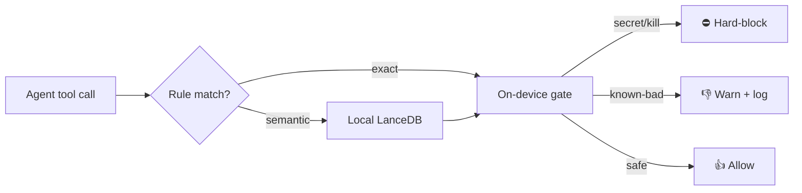

# ThumbGate 👍 👎

<p align="center">
  <a href="https://thumbgate.ai">
    
  </a>
</p>

<p align="center">
  <b>ThumbGate is the self-improving pre-action firewall for AI coding agents</b><br>
  AI coding agents repeat mistakes — and one wrong tool call can wipe a directory, leak a key, or push broken code.
</p>

<p align="center">
  <a href="https://mcptoplist.com/server/glama%2FIgorGanapolsky%2FThumbGate"></a>
  <a href="https://github.com/IgorGanapolsky/ThumbGate/actions/workflows/ci.yml"></a>
  <a href="https://www.npmjs.com/package/thumbgate"></a>
  <a href="https://www.npmjs.com/package/thumbgate"></a>
  <a href="https://github.com/IgorGanapolsky/ThumbGate"></a>
  <a href="https://github.com/marketplace/actions/thumbgate-agent-governance"></a>
  <a href="LICENSE"></a>
</p>

<p align="center">
  <a href="#quick-start"></a>
  <a href="https://thumbgate.ai/#demo?utm_source=github&utm_medium=readme"></a>
  <a href="https://thumbgate.ai/go/gpt?utm_source=github&utm_medium=readme"></a>
  <a href="https://thumbgate.ai/checkout/pro?utm_source=github&utm_medium=readme"></a>
</p>

---

## What it does

ThumbGate is the local-first **Pre-Action Checks** engine for AI coding agents. It runs in the PreToolUse hook to evaluate the proposed tool call before execution — so costly mistakes can be caught before they happen.

ThumbGate GitHub star growth is measured with GitHub's privacy-safe [`GET /repos/{owner}/{repo}/stargazers/history`](https://docs.github.com/en/rest/activity/starring#get-repository-star-history) endpoint (weekly counts, no stargazer identities). Run `npm run stars:history -- --fixture tests/fixtures/github-star-history.json --json` for the local proof. Stars are not npm installs and not revenue. The live GitHub Marketplace Action is [ThumbGate Agent Governance](https://github.com/marketplace/actions/thumbgate-agent-governance) (`uses: IgorGanapolsky/ThumbGate@v1`).

**Usage over star count.** Evaluate ThumbGate from the install path and live usage badges above (`npx thumbgate init`, Marketplace `uses:`, npm weekly downloads, GitHub clones), not from whether the repo has twenty stars or twenty thousand. No pitch deck is required. We do not farm GitHub profile badges (no YOLO-merge of protected `main`, no 5-minute Issue close theater, no fake `Co-authored-by`). Galaxy Brain needs real accepted answers in [Discussions Q&A](https://github.com/IgorGanapolsky/ThumbGate/discussions/categories/q-a). `npm run github:achievements -- --fixture tests/fixtures/github-achievements.json --json` inventories what is already earned vs what we refuse to farm.

### Who it's for

ThumbGate is for operators whose AI coding agents can leak a secret or destroy a checkout before a human sees the tool call (Claude Code, Cursor, Codex, Gemini CLI, MCP). Discovery should reach those operators — not a star campaign.

ThumbGate is **not** a GitHub star package, not fake engagement, and not a substitute for npm installs or merged PRs. Real engagement is `npx thumbgate init` and a PreToolUse hook that actually fires.

### Tech memes (shareable)

Lightweight visuals for how agents fail without a pre-action gate:

| Meme | Meaning |
|------|---------|
|  | Unchecked tool calls ship destructive commands. |
|  | A prompt is advice; a PreToolUse hook is enforcement. |


It **hard-blocks detected secret leaks and two direct self-disable command classes by default** — commands that terminate the ThumbGate gate process or enable its bypass environment override. Other high-risk classes (`rm -rf`, force-push, fetch-and-run, direct guardrail edits) **warn and log by default**. Set `THUMBGATE_STRICT_ENFORCEMENT=1` for strict enforcement (warnings become hard denies).

| Verdict | Default behavior |
|---------|------------------|
| ⛔ **Hard-block** | Detected secret leaks; process-kill/environment-override self-disable |
| 👎 **Warn + log** | `rm -rf`, `git push --force`, fetch-and-run, direct guardrail edits — **warn by default** |
| 👍 **Allow** | Everything else |

**Accepted feedback is stored as local lessons.** Repeated concrete failures can become prevention rules that promote from warnings to blocking gates. The firewall improves from operations without retraining the model. Prompt evaluation (`npx thumbgate eval`) turns accepted feedback into reusable eval cases and local proof reports.

**Honest disclaimer:** ThumbGate does not update model weights. It intercepts tool calls at runtime. Local-first — no cloud required for the enforcement path.

Works with **Claude Code, Cursor, Codex, Gemini CLI, Amp, Cline, OpenCode**, and other MCP agents.

[](https://thumbgate.ai/#demo?utm_source=github&utm_medium=readme_meme)

```
  Agent tries:   rm -rf tests/
  ThumbGate:     👎 WARN + LOG — "Never delete test directories"
                 Pattern matched: rm.*-rf.*tests
                 Source: your thumbs-down from last Tuesday
                 Strict mode: ⛔ DENY before tool execution
```

### Agentic development cycle fit

Agentic development is becoming a loop: **Guide → Generate → Verify → Solve**. ThumbGate is the pre-action gate / pre-action boundary between generated intent and executed action.

---

## Quick Start

> Want a phased walkthrough with a verify step at every stage? Follow the [Progressive Setup Guide](GUIDE.md).

Progressive wiring — prove the pipe before you turn matching on. Empty dashboard is success.

```bash
npx thumbgate init          # Phase 1: hooks only
npx thumbgate doctor        # verify: exits 0 only when PreToolUse hook is wired (hidden metric = hook install, not gate count)
npx thumbgate dashboard --open  # Phase 2: open local HTML; empty stats are OK
npx thumbgate capture --feedback=down --context="Never run DROP on production tables" --what-went-wrong="agent proposed DROP" --what-to-change="require review for DROP"
```

Later `DROP` attempts in the same scope surface the check:

```
⚠️ Check fired: "Never run DROP on production tables"
   Pattern: DROP.*production
   Verdict: 👎 WARN + LOG   (⛔ BLOCK when THUMBGATE_STRICT_ENFORCEMENT=1)
```

Numbered configs: [`config/progressive/`](config/progressive/). Guide: [progressive wiring](https://thumbgate.ai/guides/progressive-wiring).

### MCP / Glama / registry install (stdio)

Directories and clients that install ThumbGate as an MCP server must start **stdio MCP**, not the HTTP API:

```bash
npx -y thumbgate serve
```

- Equivalent: `npx -y thumbgate mcp`
- Do **not** use `npm start` for MCP — that launches the hosted HTTP API (`src/api/server.js`), not the agent-facing stdio server.

[**▶ 90-second demo**](https://thumbgate.ai/#demo?utm_source=github&utm_medium=readme&utm_campaign=demo_video) · [GIF walkthrough](docs/media/thumbgate-demo.gif)

---

## Install for your agent

| Agent | Command | Enforcement |
|-------|---------|-------------|
| **Claude Code** | `npx thumbgate init --agent claude-code` | 🛡️ Hard — PreToolUse |
| **Codex** | `npx thumbgate init --agent codex` | 🛡️ Hard — `pre_tool_use` |
| **Gemini CLI** | `npx thumbgate init --agent gemini` | 🛡️ Hard — PreToolUse |
| **ForgeCode** | `npx thumbgate init --agent forge` | 🛡️ Hard — `pre_tool_use` |
| **Cursor** | `npx thumbgate init --agent cursor` | 💬 Advisory — MCP `gate_check` |
| **Cline** | `npx thumbgate init --agent cline` | 💬 Advisory — MCP + `.clinerules` |
| **OpenCode** | `npx thumbgate init --agent opencode` | 💬 Advisory — MCP `gate_check` |
| **Any MCP agent** | `npx thumbgate serve` | 💬 Advisory — MCP `gate_check` |
| **Amp** | `npx thumbgate init --agent amp` | 📝 Feedback capture |
| **GitHub Actions** | `uses: IgorGanapolsky/ThumbGate@v1` | 🩺 Marketplace Action — doctor / AI inventory in CI |

Per-agent guides: [Claude/Codex bridge](plugins/claude-codex-bridge/README.md) · [Codex profile](plugins/codex-profile/README.md) · [Cursor](docs/CURSOR_PLUGIN_OPERATIONS.md) · [MCP setup](docs/MCP_AUTONOMOUS_SETUP.md)

### Install scope: machine-wide vs per-project

| Scope | Command | Settings | Lessons | Best for |
|-------|---------|----------|---------|----------|
| **Machine-wide** (default) | `npx thumbgate init` | `~/.claude/settings.json` | `~/.claude/memory/feedback/` | Solo operators — **same machine-local feedback store** across repos |
| **Per-project** | `npx thumbgate init --project` | `<repo>/.claude/settings.json` | `<repo>/.claude/memory/feedback/` | Client / compliance — **separate dashboard** / isolated lessons per repo |

Both scopes write `mcpServers.thumbgate` plus PreToolUse / UserPromptSubmit / PostToolUse / SessionStart hooks. Machine-wide is the right default for most developers. Cross-repo blocking is not automatic: a lesson learned in one project only applies elsewhere when you share the store (machine-wide) or export/import lessons.

**MCP tools (surface):** `gate_check` (read/evaluate proposed tool call), feedback capture + session tools (write), dashboard/stats (read). Destructive agent actions stay blocked/warned by PreToolUse — ThumbGate does not execute user shell commands for you.

---

## Discoverable slash-commands — the guardrail layer for spec-driven agents

Spec-driven agent frameworks like **GSD** (get-shit-done) and **GitHub Spec Kit** plan and generate work. ThumbGate is the **guardrail layer for spec-driven agents**: it sits *after* the plan, on the boundary between a generated tool call and its execution — **alongside GSD / Spec-Kit, not instead of them**.

`npx thumbgate init` installs these into your agent palette:

| Command | What it does |
|---------|--------------|
| `/thumbgate-dashboard` | Open local project dashboard |
| `/thumbgate-guard` | Turn last mistake into a hard prevention rule |
| `/thumbgate-rules` | List active rules & lessons |
| `/thumbgate-blocked` | Gate stats + enforcement matrix |
| `/thumbgate-protect` | Branch governance + scoped approval |
| `/thumbgate-doctor` | Health-check hooks, MCP, readiness |

---

## Pricing & buyer paths

Free tier: **2 feedback captures/day (10 total)** and **up to 3 active auto-promoted prevention rules**. Pro ($19/mo or $149/yr) is the individual tier for unlimited rules, history-aware lessons, linked feedback session flow, personal dashboard, and DPO export. **Enterprise is custom and scoped after intake**; hosted team lesson sync and a hosted org dashboard are not general availability.

| | Free | Pro ($19/mo or $149/yr) | Enterprise |
|---|---|---|---|
| Local CLI + PreToolUse | ✅ | ✅ | Scoped after intake |
| Feedback captures | 2 feedback captures/day (10 total) | Unlimited | Scoped after intake |
| Active auto-promoted rules | up to 3 active auto-promoted prevention rules | Unlimited | Scoped after intake |
| Personal dashboard + DPO export | — | ✅ | Reviewed during intake |
| Hosted team lesson sync | — | — | Not general availability |
| Hosted org dashboard | — | — | Not general availability |

**Enterprise intake path:** the **Workflow Hardening Sprint** scopes one repeated failure before any broader rollout commitment. **[Start intake →](https://thumbgate.ai/?utm_source=github&utm_medium=readme&utm_campaign=team_rollout#workflow-sprint-intake)**

**Local technical path:** install the CLI and use `init` plus the documented setup so Pre-Action Checks evaluate tool calls where the agent actually runs.

**First-dollar activation path:** open the [ThumbGate GPT](https://thumbgate.ai/go/gpt?utm_source=github&utm_medium=readme), paste the risky action, capture typed feedback (`thumbs down:` / `thumbs up:`). **Native ChatGPT rating buttons are not the ThumbGate capture path.** Ask: **what repeated AI mistake would be worth catching before the tool executes?**

**Paid path for individual operators:** [ThumbGate Pro](https://thumbgate.ai/checkout/pro?utm_source=github&utm_medium=readme&utm_campaign=pro_page) is the self-serve side lane for a personal dashboard and export-ready evidence.

[**Start free**](https://thumbgate.ai/?utm_source=github&utm_medium=readme) · [**Pro $19/mo**](https://thumbgate.ai/checkout/pro?utm_source=github&utm_medium=readme) · [**Live Dashboard**](https://thumbgate.ai/dashboard?utm_source=github&utm_medium=readme) · [**Team Sprint intake**](https://thumbgate.ai/?utm_source=github&utm_medium=readme#workflow-sprint-intake) · [**Workflow Hardening Sprint**](https://thumbgate.ai/?utm_source=github&utm_medium=readme&utm_campaign=top_cta#workflow-sprint-intake) · [**First Dollar Playbook**](docs/FIRST_DOLLAR_PLAYBOOK.md)

**Popular buyer questions:** **[AI search topical presence](https://thumbgate.ai/guides/ai-search-topical-presence?utm_source=github&utm_medium=readme&utm_campaign=buyer_questions)** · **[Relational knowledge and AI recommendations](https://thumbgate.ai/guides/relational-knowledge-ai-recommendations?utm_source=github&utm_medium=readme&utm_campaign=buyer_questions)** · **[AI Mode ads for agent governance](https://thumbgate.ai/guides/ai-mode-ads-agent-governance?utm_source=github&utm_medium=readme&utm_campaign=buyer_questions)** · **[MCP tool governance](https://thumbgate.ai/guides/mcp-tool-governance?utm_source=github&utm_medium=readme&utm_campaign=buyer_questions)** · **[AI agent pre-action approval gates](https://thumbgate.ai/guides/ai-agent-pre-action-approval-gates?utm_source=github&utm_medium=readme&utm_campaign=buyer_questions)** · **[Background agent governance](https://thumbgate.ai/guides/background-agent-governance?utm_source=github&utm_medium=readme&utm_campaign=buyer_questions)** · **[GPT-5.5 model evaluation](https://thumbgate.ai/guides/gpt-5-5-model-evaluation?utm_source=github&utm_medium=readme&utm_campaign=buyer_questions)** · **[Stop repeated AI agent mistakes](https://thumbgate.ai/guides/stop-repeated-ai-agent-mistakes?utm_source=github&utm_medium=readme&utm_campaign=buyer_questions)** · **[Browser automation safety](https://thumbgate.ai/guides/browser-automation-safety?utm_source=github&utm_medium=readme&utm_campaign=buyer_questions)** · **[Native messaging host security](https://thumbgate.ai/guides/native-messaging-host-security?utm_source=github&utm_medium=readme&utm_campaign=buyer_questions)** · **[Autoresearch agent safety](https://thumbgate.ai/guides/autoresearch-agent-safety?utm_source=github&utm_medium=readme&utm_campaign=buyer_questions)** · **[Cursor guardrails](https://thumbgate.ai/guides/cursor-agent-guardrails?utm_source=github&utm_medium=readme&utm_campaign=buyer_questions)** · **[Codex CLI guardrails](https://thumbgate.ai/guides/codex-cli-guardrails?utm_source=github&utm_medium=readme&utm_campaign=buyer_questions)** · **[Gemini CLI memory + enforcement](https://thumbgate.ai/guides/gemini-cli-feedback-memory?utm_source=github&utm_medium=readme&utm_campaign=buyer_questions)** · **[Google Cloud MCP guardrails](https://thumbgate.ai/guides/gcp-mcp-guardrails?utm_source=github&utm_medium=readme&utm_campaign=buyer_questions)** · **[Roo Code alternative: migrate to Cline](https://thumbgate.ai/guides/roo-code-alternative-cline?utm_source=github&utm_medium=readme&utm_campaign=buyer_questions)**

---

## How it works (short)

1. **Capture** 👍/👎 feedback (CLI, MCP, linked feedback session flow / `open_feedback_session`, or [ThumbGate GPT](https://thumbgate.ai/go/gpt?utm_source=github&utm_medium=readme))
2. **Promote** concrete lessons via history-aware lesson distillation into prevention rules
3. **Evaluate** the next proposed tool call against active rules (literal/AST + local vectors)
4. **Allow / warn / deny** before the tool runs

```bash
npx thumbgate brain --write   # → .thumbgate/BRAIN.md (lessons + gates in one artifact)
```

Pro operators can invoke `search_lessons` through MCP and use `npx thumbgate lessons` from the CLI. History-aware feedback sessions and lesson search are Pro capabilities; Free does not include recall or search.

<details>
<summary><b>Architecture diagram & stack</b></summary>

[](https://thumbgate.ai/#how-it-works)



</details>

<details>
<summary><b>Built-in checks</b></summary>

```
⛔ secret-exfiltration → hard-block (default)
⛔ self-protect-kill   → hard-block (default)
⛔ self-protect-env    → hard-block (default)
⚠️ force-push          → warn; hard-block under strict
⚠️ protected-branch    → warn; hard-block under strict
⚠️ unresolved-threads  → warn; hard-block under strict
⚠️ package-lock-reset  → warn; hard-block under strict
```

</details>

<details>
<summary><b>CLI cheatsheet</b></summary>

```bash
npx thumbgate init
npx thumbgate doctor
npx thumbgate capture up|down "<text>"
npx thumbgate lessons
npx thumbgate brain --write
npx thumbgate dashboard --open
npx thumbgate break-glass --reason="ThumbGate over-fired"   # 5-min recovery
```

</details>

<details>
<summary><b>Pro: lesson + DPO export</b></summary>

```bash
# Portable lessons
curl -X POST http://localhost:3456/v1/lessons/export \
  -H "Authorization: Bearer $THUMBGATE_API_KEY" \
  -H "Content-Type: application/json" \
  -d '{"outputPath": "./lessons-export.json"}'

# DPO pairs for fine-tuning
curl -X POST http://localhost:3456/v1/dpo/export \
  -H "Authorization: Bearer $THUMBGATE_API_KEY" \
  -o dpo-pairs.jsonl
```

</details>

---

## Tech Stack

| Layer | Tech |
|-------|------|
| **Runtime** | Node.js ≥18 |
| **Interfaces** | MCP stdio, HTTP API, CLI |
| **Storage** | SQLite + FTS5, LanceDB vectors, JSONL logs |
| **Intelligence** | MemAlign dual recall, Thompson Sampling, local embeddings |
| **Billing / host** | Stripe, Railway |
| **Execution** | Railway, Cloudflare Workers, Docker Sandboxes |
| **Governance** | Workflow Sentinel, control plane, Docker Sandboxes |

Every Changeset is tied to the exact `main` merge commit and generates Verification Evidence for Release Confidence.

---

## Integrations (compact)

| Surface | Start here |
|---------|------------|
| **Open ThumbGate GPT** | [thumbgate.ai/go/gpt](https://thumbgate.ai/go/gpt?utm_source=github&utm_medium=readme&utm_campaign=readme_gpt) — **ThumbGate GPT: start here.** Paste agent actions, get advice + checkpointing. **No, users do not have to keep chatting inside the ThumbGate GPT to use ThumbGate** — the **hard enforcement layer still runs where the work happens**. |
| **Install Codex Plugin** | Open the Codex plugin install page: [thumbgate.ai/codex-plugin](https://thumbgate.ai/codex-plugin) · zip: [thumbgate-codex-plugin.zip](https://github.com/IgorGanapolsky/ThumbGate/releases/latest/download/thumbgate-codex-plugin.zip) · [plugins/codex-profile/INSTALL.md](plugins/codex-profile/INSTALL.md) |
| Claude Desktop `.mcpb` | [latest release](https://github.com/IgorGanapolsky/ThumbGate/releases/latest/download/thumbgate-claude-desktop.mcpb) |
| **VS Code / Open VSX** | [plugins/vscode-extension/README.md](plugins/vscode-extension/README.md) |
| **Antigravity-compatible** | [plugins/antigravity-extension/INSTALL.md](plugins/antigravity-extension/INSTALL.md) |
| **JetBrains** | [plugins/jetbrains-plugin/README.md](plugins/jetbrains-plugin/README.md) · JetBrains Marketplace path for the same runtime |
| ChatGPT App / GPT Action | [thumbgate.ai/chatgpt-app](https://thumbgate.ai/chatgpt-app) |
| ThumbGate-Core (staging) | [https://github.com/IgorGanapolsky/ThumbGate-Core](https://github.com/IgorGanapolsky/ThumbGate-Core) — pre-release staging + a few internal cache scripts; **not** the product moat |

## Docs

Full index: **[docs/INDEX.md](docs/INDEX.md)**

| Need | Link |
|------|------|
| Agent workflow contract | [WORKFLOW.md](WORKFLOW.md) |
| Ready-for-agent intake | [.github/ISSUE_TEMPLATE/ready-for-agent.yml](.github/ISSUE_TEMPLATE/ready-for-agent.yml) |
| Verification Evidence | [docs/VERIFICATION_EVIDENCE.md](docs/VERIFICATION_EVIDENCE.md) |
| Release Confidence | [docs/RELEASE_CONFIDENCE.md](docs/RELEASE_CONFIDENCE.md) |
| Changeset strategy | [docs/CHANGESET_STRATEGY.md](docs/CHANGESET_STRATEGY.md) |
| First Dollar Playbook | [docs/FIRST_DOLLAR_PLAYBOOK.md](docs/FIRST_DOLLAR_PLAYBOOK.md) |
| Security policy | [SECURITY.md](SECURITY.md) |
| Threat model | [THREAT_MODEL.md](THREAT_MODEL.md) |
| Federal / regulated | [docs/FEDERAL.md](docs/FEDERAL.md) |
| Commercial Truth | [docs/COMMERCIAL_TRUTH.md](docs/COMMERCIAL_TRUTH.md) |
| Issues / PRs | [GitHub Issues](https://github.com/IgorGanapolsky/ThumbGate/issues) · [PR template](.github/pull_request_template.md) |

**FAQ (one-liners):** Not a fine-tuner (runtime intercept only). Different from `CLAUDE.md` / `.cursorrules` (those are context; ThumbGate is an external allow/warn/deny before tools run).

---

## Who builds this

**Igor Ganapolsky** — payments (Stripe/Connect), AI agent guardrails/MCP, Android + backends. Small number of contract slots: **$120–150/hr, 1099, remote US**. [LinkedIn](https://www.linkedin.com/in/igor-ganapolsky-859317343/) · [thumbgate.ai](https://thumbgate.ai)

## License

MIT — see [LICENSE](LICENSE). Project policy: [SECURITY.md](SECURITY.md) · [THREAT_MODEL.md](THREAT_MODEL.md).
